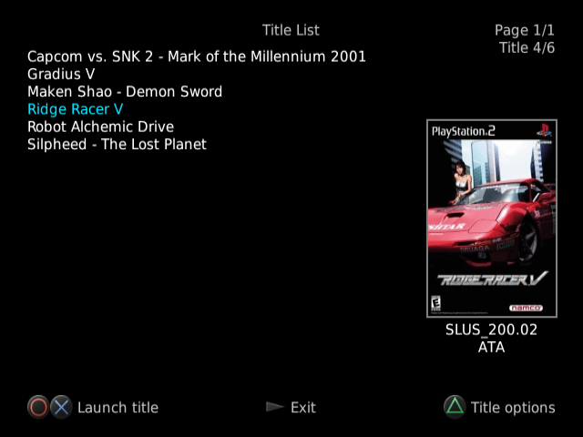
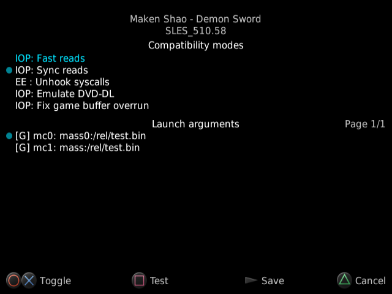

# NHDDL — a PS2 exFAT HDD launcher for Neutrino

NHDDL is a memory card-based launcher that scans internal exFAT-formatted HDD for ISO files,
lists them and boots selected ISO via Neutrino.

It displays visual Game ID to trigger per-game settings on the Pixel FX line of products and writes to memory card history file before launching the title, triggering per-title memory cards on SD2PSX and MemCard PRO 2.

## Why it exists

I have a SCPH-70000 PS2 with internal IDE—microSD mod and RetroGEM installed and I'm tired of dealing with APA-formatted drives.

## What this is not

This not an attempt at making a Neutrino-based Open PS2 Loader replacement.  
It __will not__ boot ISOs from anything other than exFAT-formatted internal HDDs.

## Usage

Just put the ELF file into Neutrino folder on your memory card and launch it.  
Make sure that Neutrino `modules` directory contains the following IRX files:
- `bdm.irx` 
- `isofs.irx`
- `bdmfs_fatfs.irx`
- `dev9_ns.irx`
- `ata_bd.irx`

Those are required to find ISO files on exFAT-formatted HDD, retrieve title ID from ISO, read cover art and config files.

### Storing ISO

ISOs can be stored anywhere on internal HDD.   
OPL-like folder structure is also supported.

### Enabling progressive (480p) output

To enable 480p output mode for the launcher (not the game) either rename the ELF file from `nhddl.elf` to `nhddl_p.elf` or create an empty file named `480p` next to `nhddl.elf`.

### Displaying cover art

NHDDL uses the same file naming convention and file format used by OPL.  
Just put **140x200** JPG or PNG files named `<title ID>_COV.jpg/png` (e.g. `SLUS_200.02_COV.jpg`) into the `ART` directory on the root of your HDD.

### Configuration files

NHDDL stores its config files in `config` directory in the root of internal HDD.

#### Remembering last launched title

To automatically point to the last launched title, NHDDL writes the full ISO path to `lastTitle.txt` (created automatically)

#### Global config file

Arguments that need to be applied to every ISO by default are stored in `global.yaml` file

#### Title-specific arguments

Arguments that need to be applied to a specific ISO are loaded from either  
`ISO name without ISO extension.yaml` or `<title ID><anything>.yaml`.  

File that has the same name as ISO has the priority.  
NHDDL creates this file automatically when title options are modified and saved in UI.

#### Config file structure

NHDDL uses YAML-like files to store and apply title arguments that are passed to Neutrino on title launch.  
For a list of valid arguments, see Neutrino README.

Example of a valid config file:
```yaml
# All flags are passed to neutrino as-is for future-proofing, comments are ignored
# Empty values are treated as a simple flag
gc: 2
mc0: mass:/memcard0.bin # file located on HDD
$mc1: mass:/memcard1.bin # disabled argument
# Arguments that don't have a value
dbc:
logo:
```

To mark an argument as disabled by default, `$` is used before the argument name.

#### Internal HDD directory structure example

`#` marks a comment

```
ART/ # cover art, optional
  |
  - SLUS_200.02_COV.jpg
  - SLUS_202.28_COV.png
  - SLUS_213.86_COV.jpg
config/
  |
   - lastTitle.txt # created automatically
   - global.yaml # optional, applies to all ISOs
   - Silent Hill 2.yaml # optional, applies only to ISOs that start with "Silent Hill 2"
   - SLUS_213.86.yaml # optional, applies to all ISOs that have a title ID of SLUS_213.86
CD/
  |
   — Ridge Racer V.iso
DVD/
  |
   - Silent Hill 2.iso
   - TOTA.iso # SLUS_213.86
   - TOTA UNDUB.iso # SLUS_213.86
```

## UI screenshots

<details>
    <summary>Title list</summary>
    
</details>
<details>
    <summary>Title options</summary>
    
</details>