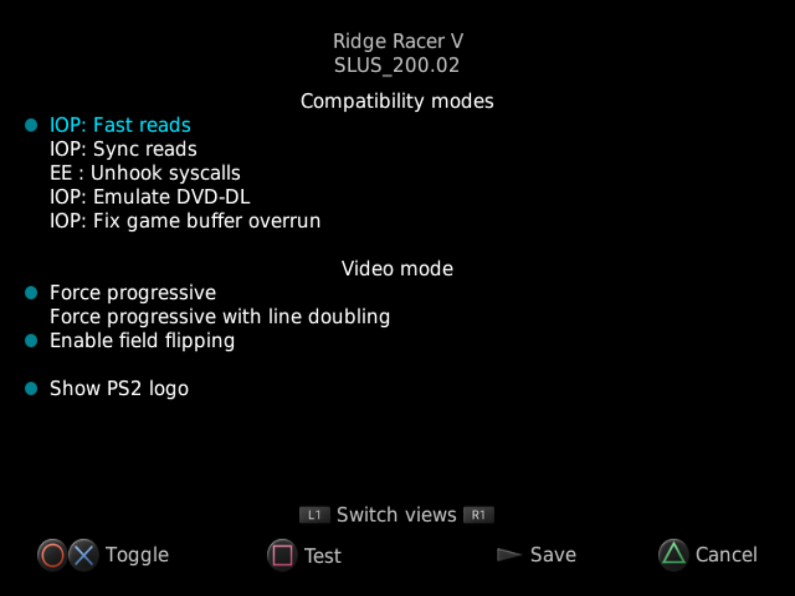
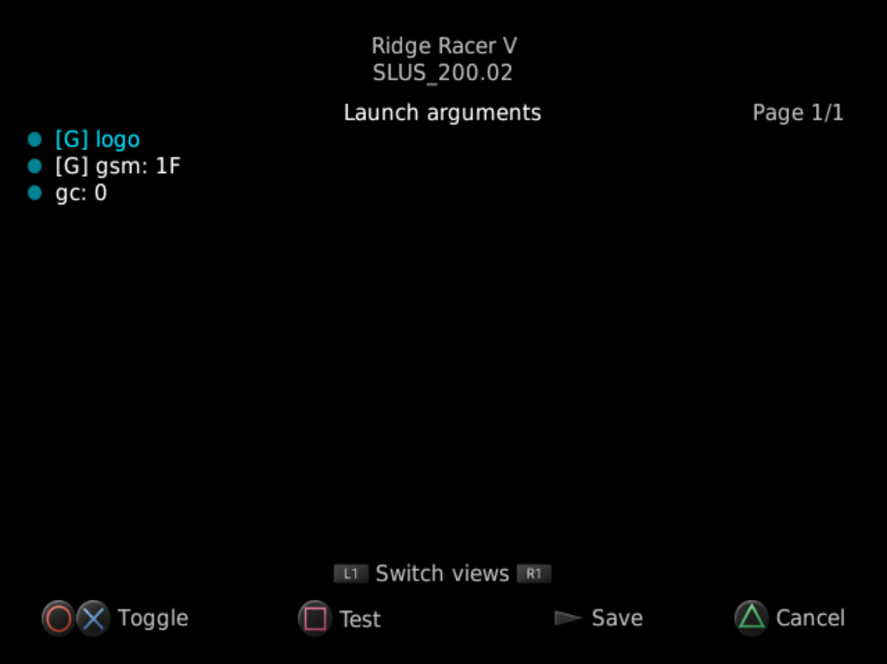

# NHDDL — a PS2 launcher for Neutrino

<p align="center">
  
</p>

NHDDL is a Neutrino launcher that scans MMCE, APA or _FAT/exFAT-formatted_ BDM devices for ISO files,
lists them and boots selected ISO via Neutrino.  

It displays visual Game ID to trigger per-title settings on the Pixel FX line of products and triggers per-title memory cards on SD2PSX and MemCard PRO2.

Note that this not an attempt at making a Neutrino-based Open PS2 Loader replacement.  
Since NHDDL only launches Neutrino, PADEMU, IGR, IGS, cheats and other features supported by OPL are _out-of-scope_ unless they are implemented in Neutrino.

## Usage

### Title list controls

 - Press **Up** on the d-pad to select the **previous title** in the list
 - Press **Down** on the d-pad to select the **next title** in the list
 - Press **L1** to switch to the **previous page** or go to the **start of the list**
 - Press **R1** to switch to the **next page** or go to the **end of the list**

### Important notes

NHDDL requires a full [Neutrino](https://github.com/rickgaiser/neutrino) installation to be present at one of the following paths:
- `<NHDDL launch directory>/neutrino.elf` (__might be case-sensitive__ depending on device)
- `massX:/neutrino/neutrino.elf` (BDM devices, if any of BDM modes are enabled)
- `hdd0:/<OPL partition>/neutrino/neutrino.elf` (APA device, if HDL mode is enabled)  
  `OPL partition` is read from `hdd0:__common/OPL/conf_hdd.cfg`, with `+OPL` or `__common/OPL` used as a fallback
- `mmceX:/neutrino/neutrino.elf` (MMCE devices, will work even if MMCE mode is _not_ enabled unless MX4SIO mode is set)
- `mcX:/APPS/neutrino/neutrino.elf` (memory cards, __case-sensitive__)
- `mcX:/NEUTRINO/NEUTRINO.ELF` (SAS-compliant path on memory cards, __case-sensitive__)
- `mcX:/NEUTRINO/neutrino.elf` (SAS-compliant path on memory cards, __case-sensitive__)

By default, NHDDL tries to initialize all supported devices. You can override this behavior and reduce initialization times by setting specific mode in launcher configuration file.  
See [this](#launcher-configuration-file) section for details on `nhddl.yaml`.  

Note that if your ELF loader resets IOP (e.g. `PS2BBL` and recent versions of `wLE_ISR`), NHDDL will try loading `nhddl.yaml` from memory cards and MMCE devices first to avoid
loading modules for all devices.  
If `nhddl.yaml` is not present on any of the memory cards or MMCE devices, NHDDL will initialize all modules first and then will attempt to search for `nhddl.yaml` again.

**Do not plug in any BDM storage devices while running NHDDL!**  
Doing so might crash NHDDL and/or possibly corrupt the files on your target device due to how BDM drivers work.

#### Manual installation

To use NHDDL:
- Get the [latest `nhddl.elf`](https://github.com/pcm720/nhddl/releases)
- Copy `nhddl.elf` to your memory card or storage device wherever you want.
- _Additional step if you need only some of the available modes or MX4SIO support_:  
  1. Modify `nhddl.yaml` [accordingly](#launcher-configuration-file) and copy it next to `nhddl.elf`.  
  See notes on [the configuration file](#launcher-configuration-file) for more information
  2. When loading NHDDL from APA or BDM, there is no reliable way to get modes from `nhddl.yaml`.  
  You can [rename the ELF](#forcing-a-specific-mode-via-the-nhddl-elf-file-name) to force a specific mode
- Get the [latest Neutrino release](https://github.com/rickgaiser/neutrino/releases)
- Copy Neutrino folder to the root of your PS2 memory card or your storage device. 

#### Save Application System PSU

You can also get NHDDL as an easy-to-use PSU package [here](https://pcm720.github.io/nhddl-psu/).  
To install it:
- Copy generated `nhddl.psu` to your USB drive
- Open wLaunchELF on your PS2
- Choose your USB device and copy `nhddl.psu`
- Go back and open your memory card (`mc0` or `mc1`)
- Open file menu and select `psuPaste`
- Get the [latest Neutrino release](https://github.com/rickgaiser/neutrino/releases)
- Copy Neutrino folder to the root of your PS2 memory card or your storage device. 

This will install NHDDL to your memory card along with the PS2 Browser icon.
 
Updating `nhddl.elf` is as simple as replacing `nhddl.elf` with the latest version.

### Supported modes

#### ATA (MBR/GPT-formatted HDD with exFAT partition)

To skip all other devices, `mode: ata` must be present in `nhddl.yaml`.

#### MX4SIO

MX4SIO support requires explicit configuration due to conflicts with memory cards and MMCE devices.  
`mode: mx4sio` must be present in `nhddl.yaml` on __the memory card__ for MX4SIO to work.  

Note that __MMCE devices will not be available__ when this mode is enabled.

#### USB

Using more than one USB mass storage device at the same time is not recommended.
To skip all other devices, `mode: usb` must be present in `nhddl.yaml`.

#### UDPBD

To skip all other devices, `mode: udpbd` must be present in `nhddl.yaml`.

UDPBD module requires PS2 IP address to work.  
NHDDL attempts to retrieve PS2 IP address from the following sources:
- `udpbd_ip` flag in `nhddl.yaml`
- `SYS-CONF/IPCONFIG.DAT` on the memory card (usually created by w/uLaunchELF via `MISC/Configure/Network Settings...`)

`udpbd_ip` flag takes priority over `IPCONFIG.DAT`.

Make sure to set the IP address in Neutrino config files (as of Neutrino 1.6.0, `config/bsd-udpbd.toml`).  
Consult Neutrino documentation for more details.

Recommended UDPBD server implementations:
- [udpbd-server](https://gitlab.com/ps2max/udpbd-server) by Maximus32
  - Supports serving physical disks or disk images
  - Supports read and write operations
  - Preferred server implementation for *nix systems
- [udpbd-vexfat](https://github.com/awaken1ng/udpbd-vexfat) by Awaken1ng
  - Creates virtual exFAT filesystem from directory contents
  - Supports only read operations

#### iLink

To skip all other devices, `mode: ilink` must be present in `nhddl.yaml`.

#### MMCE (SD2PSX, MemCard PRO2)

To skip all other devices, `mode: mmce` must be present in `nhddl.yaml`.

#### HD Loader (APA-formatted HDD with HDL partitions)

Note that HDL backend **does not support** VMCs and virtual HDDs.  
Cover art, `nhddl.yaml` title options will be loaded from the OPL partition set in
`hdd0:__common/OPL/conf_hdd.cfg`, with `+OPL` or `__common/OPL` used as a fallback.

To skip all other devices, `mode: hdl` must be present in `nhddl.yaml`.
However, due to how device modules are initialized, this will not improve the initialization times.

### Storing ISO (MMCE, BDM backends)

ISOs can be stored almost anywhere on the storage device, but no more than 5 directories deep.  
For example, ISOs stored in `DVD/A/B/C/D` will be scanned and added to the list, but ISOs stored in `DVD/A/B/C/D/E` will be ignored.  

Furthermore, directories that start with `.`, `$` and the following directories are ignored to speed up the scanning process:
 - `nhddl`
 - `APPS`
 - `ART`
 - `CFG`
 - `CHT`
 - `LNG`
 - `THM`
 - `VMC`
 - `XEBPLUS`
 - `MemoryCards`

### Displaying cover art

NHDDL uses the same file naming convention and file format used by OPL.  
Just put **140x200 PNG** files named `<title ID>_COV.png` (e.g. `SLUS_200.02_COV.png`) into the `ART` directory on the root of your device.  
If unsure where to get your cover art from, check out the latest version of [OPL Manager](https://oplmanager.com).

### Passing arguments

Similar to Neutrino, NHDDL supports receiving launcher options from `argv` in the `-<arg>=<value>` format.  
Be aware that passing any argument will cause NHDDL to completely skip loading launcher configuration files from any device.  

For example, to initialize NHDDL with UDPBD mode, you can run `nhddl.elf` with `-mode=udpbd` and `-udpbd_ip=192.168.1.6`.  

If NHDDL receives `-mode` and `-dvd=<path to the image file>`, it will skip UI initialization and directly launch Neutrino while respecting all arguments specified in argument files.  
Add `-noinit` argument to skip IOP initialization (make sure all required modules are already loaded).  

See [this file](examples/nhddl.yaml) for a list of all supported arguments and their possible values.

### Forcing a specific mode via the NHDDL ELF file name

When loading NHDDL from APA or BDM, there is no reliable way to get modes from `nhddl.yaml` other than passing arguments. However, not a lot of launchers support this.  
To work around this, you can add a postfix to `nhddl.elf` to force a specific mode:
- `nhddl-ata.elf` — force ATA mode
- `nhddl-mmce.elf` — force MMCE mode
- `nhddl-hdl.elf` — force HDL mode
- `nhddl-udpbd.elf` — force UDPBD mode
- `nhddl-usb.elf` — force USB mode
- `nhddl-ilink.elf` — force iLink mode
- `nhddl-m4s.elf` — force MX4SIO mode

NHDDL will only initialize the mode specified in the file name and respect all other options from `nhddl.yaml` on the storage device.
When forcing UDPBD mode, make sure you've configured `SYS-CONF/IPCONFIG.DAT` on your memory card.

## Configuration files

NHDDL uses YAML-_like_ files to load and store its configuration options.

### Launcher configuration file

Launcher configuration is read from the `nhddl.yaml` file.

Configuration file is loaded from one of the following paths:
- `<NHDDL launch directory>/nhddl.yaml` (__might be case-sensitive__ depending on device)
- `massX:/nhddl/nhddl.yaml` (BDM devices, if any of BDM modes are enabled)
- `hdd0:/<OPL partition>/nhddl/nhddl.yaml` (APA device, if HDL mode is enabled)  
  `OPL partition` is read from `hdd0:__common/OPL/conf_hdd.cfg`, with `+OPL` or `__common/OPL` used as a fallback
- `mmceX:/nhddl/nhddl.yaml` (MMCE devices, will work even if MMCE mode is _not_ enabled unless MX4SIO mode is set)
- `mcX:/APP_NHDDL/nhddl.yaml` (memory cards, __case-sensitive__)

This file is _completely optional_ and must be used only to force video mode in NHDDL UI or set NHDDL device mode.  
By default, default video mode is used and all BDM devices are used to look for ISO files.

To disable a flag, you can just comment it out with `#`.

See [this file](examples/nhddl.yaml) for an example of a valid `nhddl.yaml` file and a list of all supported arguments and possible values.

### Additional configuration files on storage device

NHDDL stores and looks for ISO-related config files in `nhddl` directory in the root of your BDM drive.  

#### `lastTitle.bin`

This file stores the full path of the last launched title and is used to automatically navigate to it each time NHDDL starts up.  
This file is created automatically.

#### `cache.bin`

Contains title ID cache for all ISOs located during the previous launch, making building ISO list way faster.  
This file is also created automatically.

#### Argument files

These files store arbitrary arguments that are passed to Neutrino on title launch.  
Arguments stored in those files __are passed to `neutrino.elf` as-is__.

Ensure that paths are as short as possible as the combined length of all arguments cannot exceed approximately 255 characters. If this limit is exceeded, arguments will be truncated when passed to Neutrino, potentially causing unpredictable results such as returning to the PS2 menu or ignoring some arguments.  
Note that NHDDL always adds `-bsd=<>`, `-dvd=<full path to ISO>`, and `-qb` arguments to load the title, which reduces the actual allowable length below 255 characters.

_For a list of valid arguments, see Neutrino README._

Example of a valid argument file:
```yaml
# All flags are passed to neutrino as-is for future-proofing, comments are ignored
gc: 2
mc0: /memcard0.bin # all file paths must be relative to device root, the actual mountpoint will be added automatically
$mc1: /VMC/memcard1.bin # this argument is disabled
# Arguments that don't have a value
# Empty values are treated as a simple flag
dbc:
logo:
```

To be able to parse those arguments and allow you to dynamically enable or disable them in UI,  
NHDDL uses a dollar sign (`$`) to mark arguments as enabled or disabled by default.  
Only enabled arguments get passed to Neutrino.

NHDDL supports two kinds of argument files:

#### global.yaml

Arguments stored in `nhddl/global.yaml` are applied to every ISO by default.

#### ISO-specific files

Arguments stored in `nhddl/<ISO name>.yaml` are applied to every ISO that starts with `<ISO name>`.  

NHDDL can create this file automatically when title compatibility modes are modified and saved in UI.

#### Example of directory sturcture on BDM device

```
ART/ # cover art, optional
  |
  - SLUS_200.02_COV.png
nhddl/
  |
   - lastTitle.txt # created automatically
   - cache.bin # created automatically
   - global.yaml # optional argument file, applies to all ISOs
   - nhddl.yaml # NHDDL options, applied after initialization is complete
   - Silent Hill 2.yaml # optional argument file, applies only to ISOs that start with "Silent Hill 2"
CD/
  |
   — Ridge Racer V.iso
DVD/
  |
   - Silent Hill 2.iso
   - TimeSplitters.iso
```

## UI screenshots

<details>
    <summary>Title list</summary>
    
</details>
<details>
    <summary>Title options</summary>
    
    
</details>
